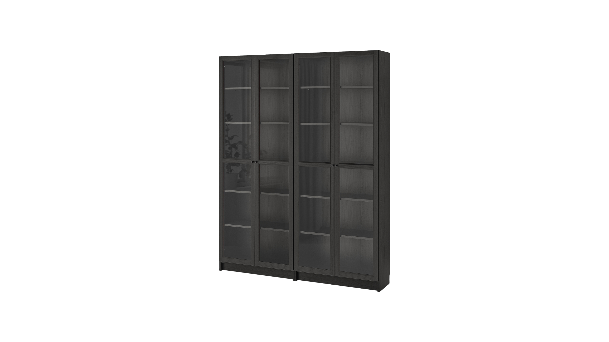
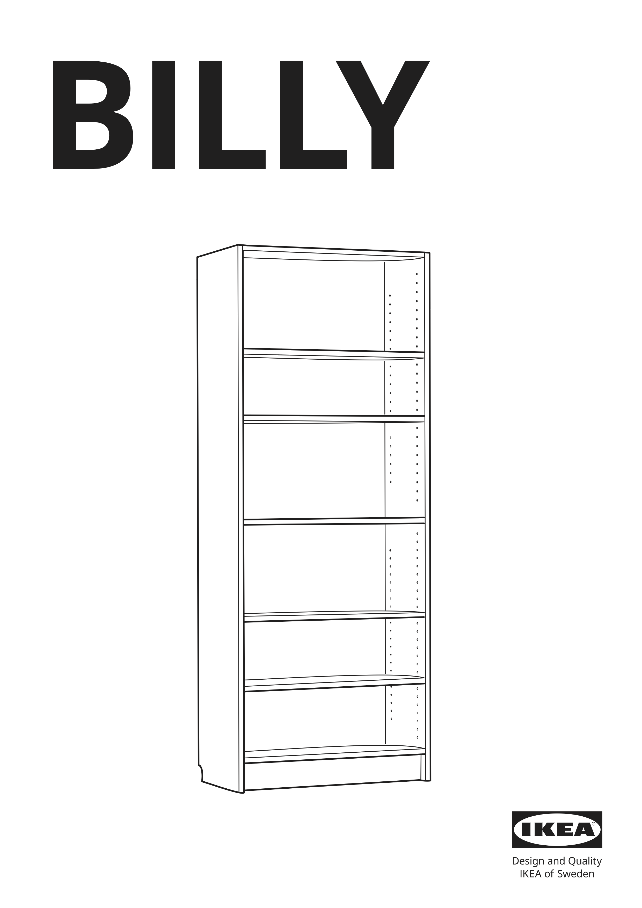

# Re-thinking product adoption through documentation design

By Pedro MC Fernandes at 

<!--
_class: sep
-->

<!--
- Thank you for the opportunity
- Enjoying this design focused event
- Hope to be here again next year
-->

---

### Pedro

- A father and a lover
- Living in greater Lisbon, Portugal
- Hands-on creator inspired by arts
- Experience with 0–1 projects + eCommerce + operations
- All-round designer
- Product designer at Percona
- Generalist contributor in FOSS

<!--
Who's Pedro?

- Lisbon, Portugal
- Experience in various industries
- Also eCommerce
- Designer at Percona
- Contributor in FOSS for a long while
- Support, translation, some design

Alt: Photo of a typical portuguese village street. Very narrow, with cobblestone and white painted houses.
-->

---

- Freedom to choose ethos
- Provider of open-source database services, support, and software

#### Known for

- Open-source, drop-in replacements for **PostgreSQL/MySQL/MongoDB**
- **Percona Toolkit** command-line tools
- **PMM** database monitoring tools
- Cloud-native database **Operators**

<!--
Where is this happening?

- Born out DB services and consulting
  - For small, growing and large companies
  - Later, open-source software
- To support services, namely...
- Promote freedom to choose

Alt: 3 photos of the Percona team at gatherings and events.
-->

---

## Re-thinking product adoption through documentation design

Why would we?

<!--
_class: sep
-->

<!--
Read
-->

---

### Motivations

- Databases for everyone
- Promote independence
- More and better contributions
- Optimization of Support
- Don’t break the bank

<!--
Here are some of our motivations:

- Databases for everyone
  - Any technical bg
  - Spark creativity
  - Help learn
- Promote independence
  - Lower the entry barrier
  - Reduce effort + time
- With this
  - Better contributions
    - From anyone to anybody
  - Optimization of Support
    - Focus on bigger problem
    - Societal blockers
    - Medical industry
    - Or other sensitive area
- Don’t break the bank
  - Anyone can get in
  - Regardless of price
  - Grow at their pace
  - Scale when ready

Alt: Photo of a hairdresser saloon with two people facing each other with, probably, payment devices in front of them as if they are about to process payments with their customers.
-->

---

### Databases = Hard  Software = Hard  Design = Hard

- Technical, complex, costly
- Error 404: Design culture not found
- Rapid software dev. ≠ Rapid UX dev.

<!--
_class: v-align
-->

<!--
Databases:
- Technical
- Intimidating
- Specific terminology
- Abstract structures
- Lack user centricity

Percona:
  - Wasn't born user-centric
  - Lack a design culture
  - Focused on technical solutions
  - Working/not working things

Concurrent rapid development
- Software dev + UX dev
- Not possible in unprepared teams
  - Needs deep integration
    - Team
    - Processes
- More time spent

Alt: Image of a meme. It's the Austin Powers movie villains laughing and then overlaid the phrase "We'll ask for estimates and then treat them as dealines"
-->

---

While we develop growth strategies in-product, what else could we do **now**?

<!--
class: sep boost
-->

<!--
Read
-->

---

Imagine assembling this…

<!--
_class: boost v-align h-align
-->

<!--
Ikea Billy bookshelf with Oxberg doors
-->

---

By only guessing

<!--
_class: boost v-align h-align
-->

<!--
... Where each part fits!

Alt: AI generated image of a realistic depiction of a lot of furniture pieces, ready to be assembled.
-->

---

With documentation, we can promote the adoption and good use of products.

<!--
_class: boost v-align h-align
-->

<!--
- Well designed documentation
- Like IKEA's instructions booklet
- Errors can still happen
- But it improves the experience

Alt: Cover of the Ikea Billy instructions booklet.
-->

---

With databases, even if you’re an expert,  you must keep the documentation tab open.

<!--
_class: boost h-align
-->

<!--
Development, management and monitoring of databases:
- An entire world
- Connections to make
- Components to upgrade
- Queries to optimize
- Security concerns
- Performance concerns
- And more

Alt: Diagram showing the phases of databases use in software developement: installation, development and upkeeping of the application. Below a screenshot detail of the browser tabs showing the documentation open.
-->

---

## Documentation design rationale

<!--
_class: sep
-->

<!--
- What we did
- What we learned
- What we think
- Open discussion
- Spark ideas
-->

--- 

### Define a strategy

Who’s reading our documentation?
How can it help them and us achieve our goals?
How do we know if it is helping?

<!--
_class: v-align padding-null-right
-->

<!--
Problem:
- No strategy in docs
- Not an instrument to achieve goals
- Just existed...

We wanted to change that and ask... Read
-->

---

We want documentation to reach out to more **developers** interested in open-source databases for their applications so that adoption increases through more **installations**, proper **retention**, and evident **ease of use**.

<!--
_class: v-align boost h-align
-->

<!--
You can go deeper, like with:
- Identify people and audit accessibility
- Set objectives
- Define the action scope
- Establish the ownership
- Set standards
- Define tech stack
- Pick health metrics
- Set feedback streams
- Plan maintenance
-->

---

### Establish co-ownership

Who could help?
Where’s the knowledge?
Who could share responsibilities?

<!--
_class: v-align padding-null-right
-->

<!--
Problem:
- Documentation just existed
- Bare minimum effort to exist in parallel
- Had to exist cuz we software house

This is not enough. We asked... Read
-->

---

#### Kept

- Creation of content
- Management
- Data analysis

#### Added

- Speed
- Visibility
- Openness
- User’s POV
- Horizontal communication
- New methods
- New tools

<!--
_class: v-align content-flush-top padding-null-right
-->

<!--
Added:
- Speed + visibility + openness
  - More people seeing
  - Recognizing importance
  - Incite contribution
- We shared all outputs
- Brought user representation
  - Technical Services
  - Account managers
  - Customer success
  - More empirical knowledge
- PMs helped
  - Communicate horizontally
  - Draw attention
  - Move things
  - Garner resources
  - Product POV
- UX team
  - New ways of doing
  - Problem-solving techniques
  - Propose solutions
  - Explored new tools
    - Posthog

Alt: Diagram of the various departments that were already working on the documentation and the other departments that were invited into it to add expertise.
-->

---

### Boost clarity

Is the content accessible to people?
Does it provide intuitive access to their needs?
Are there untapped opportunities?

<!--
_class: v-align padding-null-right
-->

<!--
We wanted to ask... Read
-->

---

<!--  -->
<!--  -->
<video width="858" height="483" autoplay controls mute loop src="../img/docs-design/old.mp4"></video>

<!--
_class: v-align h-align
-->

<!--
In practice, we did:
- Audited websites
- UX analysis
- Identify mistakes
- Detect opportunities

We had 17x websites like this

Built in MkDocs + Material theme
- Flexible
- Practical
- Beautiful theme
- Open-source
- A lot of alternatives exist
  - Docusaurus
  - Vitepress
  - Starlight
  - Markdoc
  - Docsify

Alt: Video showing the old website. The particularity here is that is text heavy and dense.
-->

---

#### Tweaked

- Applied readable fonts
- Added spacing
- Increased chromatic contrast
- Increased reading contrast (headings Vs. running text blocks)
- On-brand re-styling

<!--
_class: content-flush-top
-->

<!--
Read

Alt: Screenshots of documentation websites showing the before and after the tweaking.
-->

---

#### Added

- Guidelines and resources to place icons, buttons, dividers, and tabs
- Guidelines to flag critical bits of content and decision-making points

<!--
_class: content-flush-top
-->

<!--
Problem:
- Not using the full potential
- Maintainers: not versed in visual arrangement
- UX team open to help

Alt: Screenshots of documentation websites showing the before and after adding functionalities.
-->

---

#### Extended

- New custom components
- Use of more out-of-the-box components

<!--
_class: v-align padding-null-right
-->

<!--
MkDocs:
- Great out of the box

But we wanted more:
- New components
  - Tiny Admonitions
    - When you want more subtle
  - Framed Content
    - When you wish to disrupt
    - Announce
- Shaped out-of-the-box components
  - Feedback module

Alt: Screenshot showing the documentation website page where we added new components.
-->

---

### Unify the experience

Imagine using the documentation.
How does it look? How might we improve it?
Does it feel whole and credible?

<!--
_class: v-align padding-null-right
-->

<!--
Read
-->

---

<!--
_class: h-align
-->

<!--
Problems:
- Documentation left by chance
- Disconnected experience
  - Force user to jump
  - Main site to docs
  - Docs to main site
- Hard maintenance
  - 2 places
  - 2 departments
  - 2 tech stacks
  - 2 UX

Solution:
- Move Docs Home to Docs field
- Easy maintenance
- 1 ownership
- Cohesive experience
  - Same navigation
  - Same styling
- Feeling of whole

Alt: Diagram showing the before and after change we did to unify the experience. The major difference is the creation of a new page called "home", exclusively for the documentation, to help drive users that land anew there.
-->

---

<!--  -->
<!--  -->
<video width="1120" height="630" autoplay controls mute loop src="../img/docs-design/home-long.mp4"></video>

<!--
_class: v-align h-align
-->

<!--
- Now you'd be in 1 place only
- Docs URL leads to sub docs
- Boost aesthetic-usability FX
  - Perceived professionalism
  - Perceived functionalism
  - "Things will work"

Alt: Video showing the new version of the documentation website and how it is more clear that every page belongs to the same website.
-->

---

### Improve the user experience

What can we do for people?
How might we anticipate their needs?
How can we make them succeed?

<!--
_class: v-align padding-null-right
-->

<!--
We asked... Read

Research:
- Talked with customers
- Talked with experts
- Identified problems w/ nav
- Garnered the needs
-->

---

#### Invested in

- Experimenting
- Creating guidelines
- Forming quickstart guides
- Visual prominence for what matters the most

<!--
_class: v-align padding-null-right
-->

<!--
- Experimentation
  - Navigation
  - Top nav added confusion
  - In conjuntion w/ side nav
- To improve side nav, created guidelines
  - Make it slimmer
  - Streamlined
  - Clearer
  - Uncluttered
- Formed narratives to navigate users
  - Guides
  - Quickstart installation
  - Highlight obvious paths
  - Lead to the value

Alt: Screenshot of the documentation website page where we highlighted the quickstart guides with prominent bullet points.
-->

---

We crafted journeys and woven them together so we could guide people into **discovering the value** of our software.

<!--
_class: 
-->

<!--
- We used visual cues
- Apply where needed
- Signpost main journeys
- While providing alternatives
- Avoid roadblock feeling in users

Alt: Screenshot of the documentation website pages where we show the use of icons, buttons and other elements to help guide the user.
-->

---

### Overview

- Defined a strategy for the documentation
- Established the co-ownership
- Made it clearer and accessible
- Improved the user experience
- Unified documentation websites’ experience

  

### To do

- How users are experiencing
- Review outdated content
- Weed out inconsistencies
- Add practical examples/recipes

<!--
_class: v-align content-flush-top
-->

<!--
Overview:
- Defined a strategy
  - Generate consensus
  - Value of docs for the team goals
- Established the co-ownership
  - Share responsibility
  - Garner expertise
  - Stronger collab
- Made it clear and accessible
  - Readable
  - Visible
  - Tweaked to meet needs
  - Extended to better serve
- Improved the user experience
  - Researched
  - Experimented
  - Created guidelines
  - Highlighted/fixed main journeys
  - Cross-linking between journeys
- Unified documentation websites’ experience
  - Made it feel whole
  - Ease navigation
  - Professional looking

To do:
- How users are experiencing it
  - Is it effective?
  - Do we have more adoption?
- Review outdated content
  - A lot of bloat left
  - Needs thorough review
- Weed out inconsistencies
  - Make 17 instances closer to each other
  - Similar
  - Intuitive
- Add practical examples/recipes
  - People benefit from examples
  - Create more solutions through time
-->

---

## Thank you!

##### Re-thinking product adoption through documentation design

By Pedro MC Fernandes at

pedro@pmcf.xyz
freenandes@mastodon.social

Rendered with [Marp](https://github.com/marp-team/marpit) and [Lexend](https://github.com/googlefonts/lexend)

<!--
_class: v-align h-align
-->

