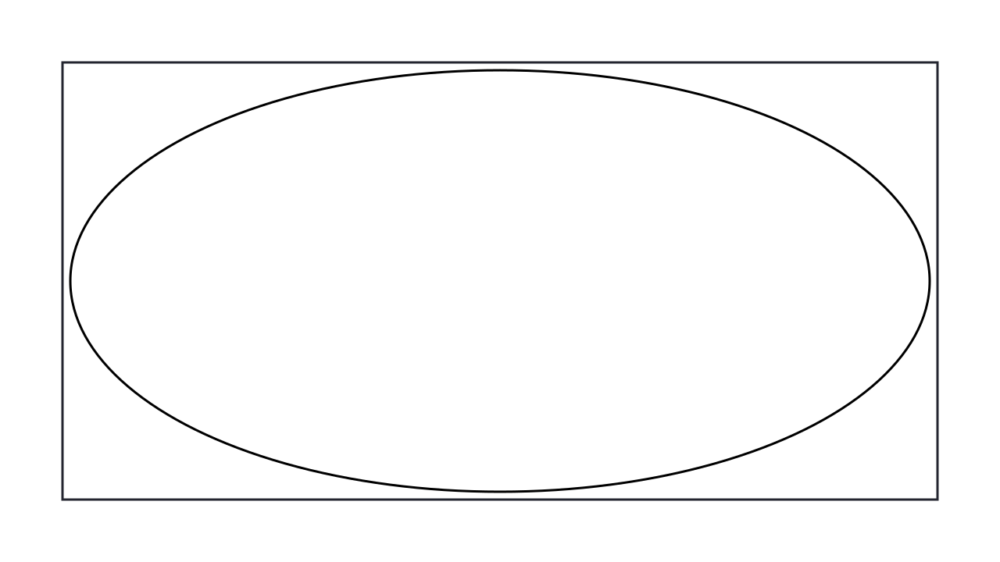
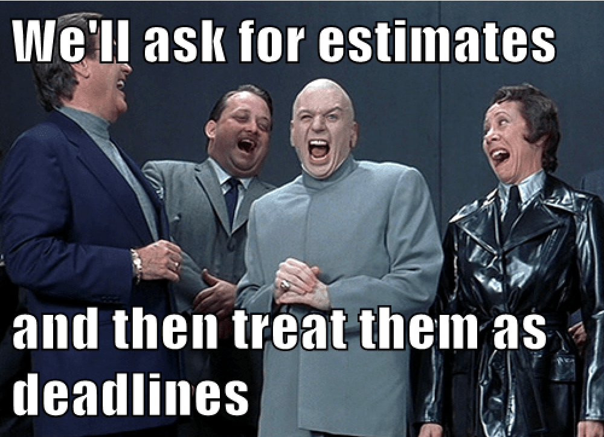
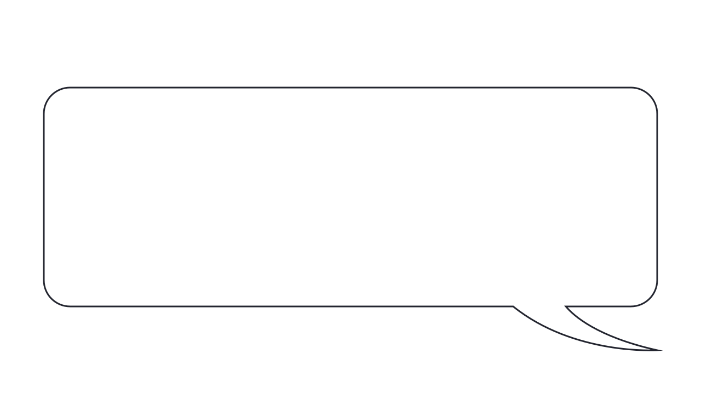
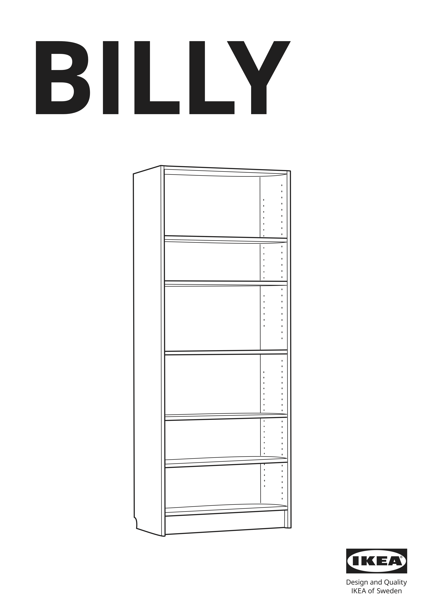
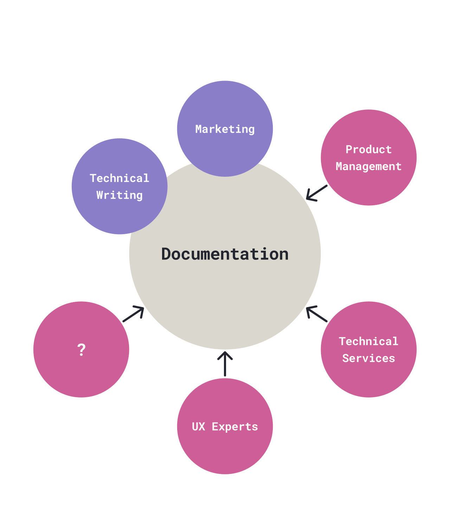
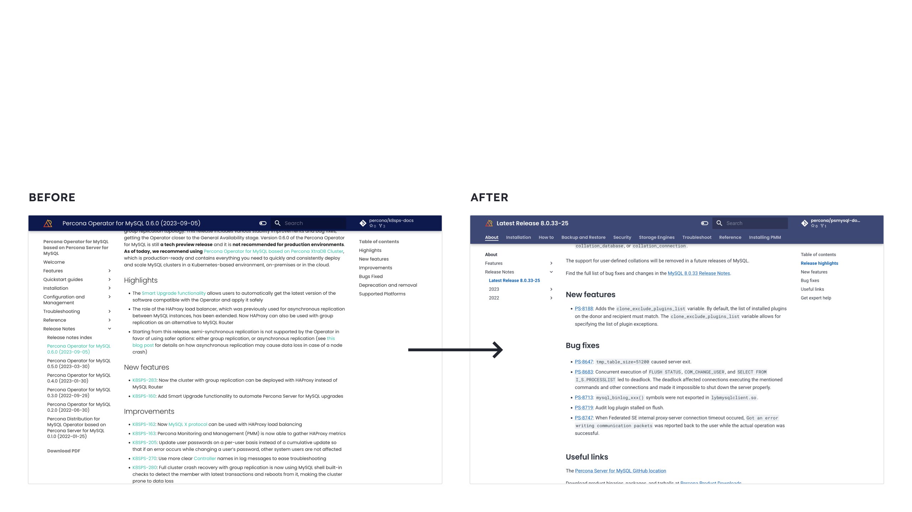
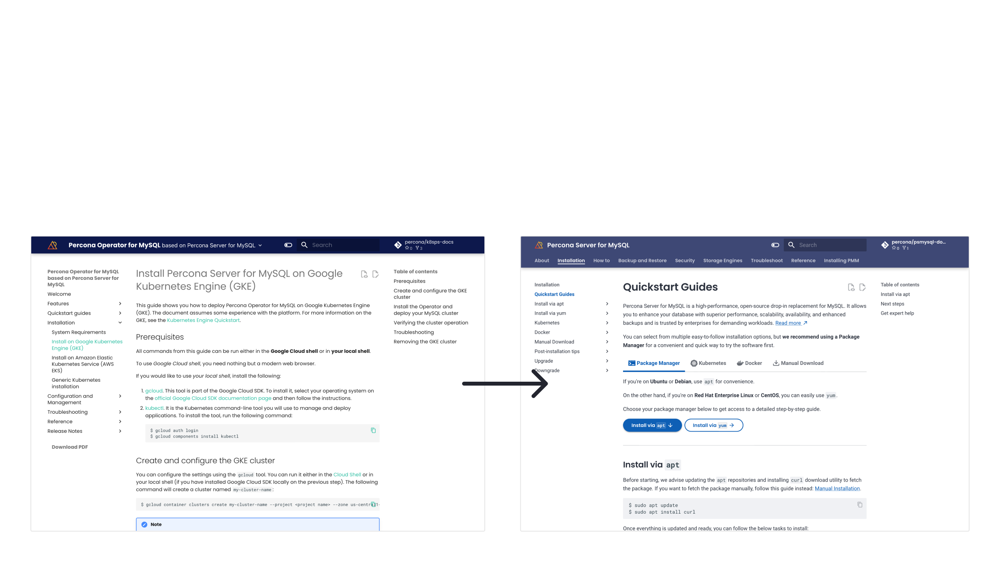
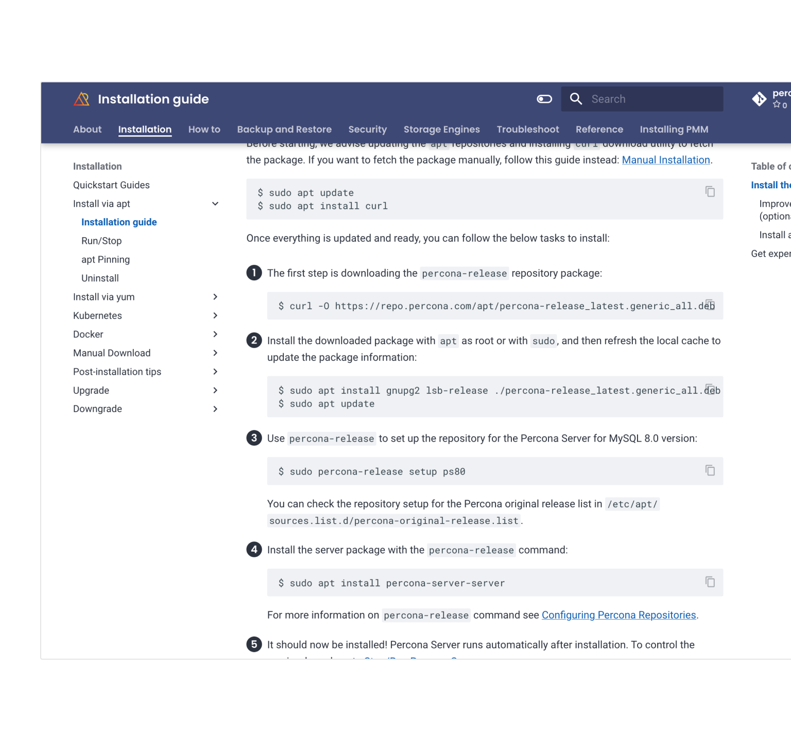
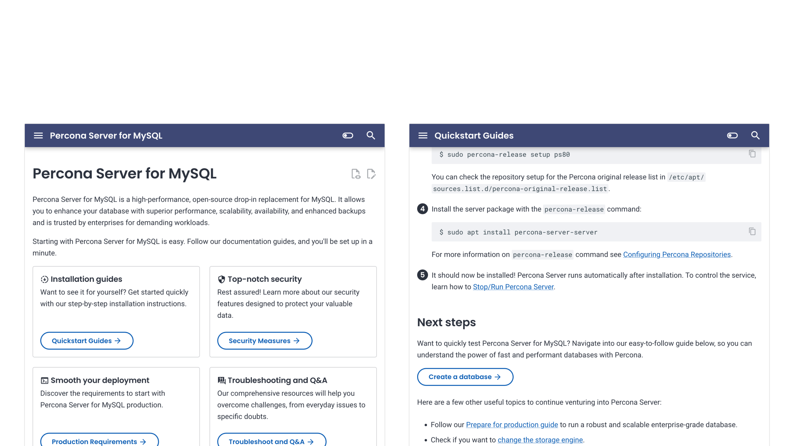
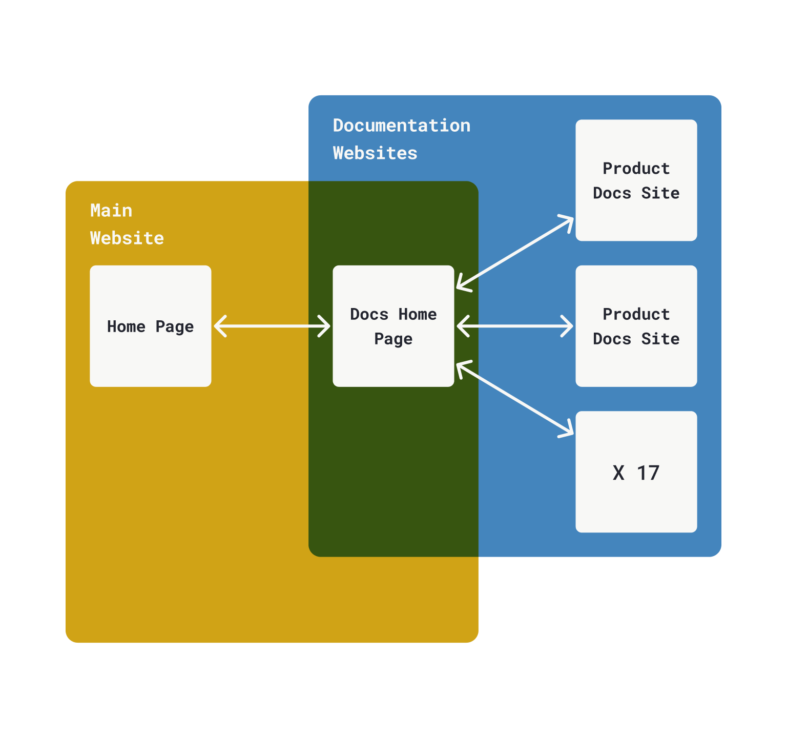

# Re-thinking product adoption through documentation design

By Pedro MC Fernandes at <svg class="percona" width="141" height="24" viewBox="0 0 282 48" fill="none" xmlns="http://www.w3.org/2000/svg"><title>Percona</title><path d="M42.714 29.146c5.514-3.604 7.318-10.957 3.981-16.736a12.45 12.45 0 0 0-7.608-5.84 12.438 12.438 0 0 0-8.88.915L26.447.976l-7.805 13.518L.602 45.739h51.691l-9.58-16.592ZM38.202 9.881a9.036 9.036 0 0 1 5.525 4.236c2.394 4.143 1.15 9.397-2.733 12.05l-9.07-15.706a9.04 9.04 0 0 1 6.278-.58ZM26.447 7.837l19.902 34.47H34.704L20.622 17.925l5.824-10.087.001-.001ZM6.546 42.307 18.64 21.362l12.095 20.945H6.546Z" fill="url(#a)"/><path d="M81.802 30.375h-5.01v8.964h-6.594V9.449h12.253c7.153 0 11.48 4.223 11.48 10.333v.081c0 6.919-5.395 10.504-12.121 10.504l-.008.008Zm5.437-10.462c0-2.947-2.054-4.527-5.355-4.527h-5.1v9.135h5.224c3.3 0 5.223-1.966 5.223-4.527v-.081h.008ZM97.611 39.341V9.448h22.617v5.854h-16.062v6.067h14.132v5.854h-14.132v6.28h16.276v5.854h-22.83v-.016ZM143.802 39.341l-6.422-9.563h-5.181v9.563h-6.595V9.448h13.706c7.071 0 11.308 3.717 11.308 9.866v.081c0 4.824-2.61 7.86-6.423 9.269l7.325 10.675h-7.72l.002.002Zm.132-19.683c0-2.815-1.972-4.274-5.181-4.274h-6.552v8.582h6.684c3.211 0 5.049-1.711 5.049-4.224v-.084ZM169.523 40.14c-8.939 0-15.58-6.879-15.58-15.582v-.084c0-8.612 6.507-15.664 15.846-15.664 5.727 0 9.162 1.9 11.983 4.67l-4.252 4.887c-2.347-2.124-4.728-3.417-7.773-3.417-5.118 0-8.814 4.24-8.814 9.434v.084c0 5.195 3.604 9.516 8.814 9.516 3.47 0 5.6-1.385 7.989-3.551l4.253 4.282c-3.13 3.335-6.6 5.41-12.458 5.41l-.008.015ZM199.63 40.14c-9.378 0-16.104-6.968-16.104-15.582v-.084c0-8.612 6.816-15.664 16.186-15.664 9.371 0 16.105 6.968 16.105 15.582v.084c0 8.612-6.816 15.664-16.187 15.664Zm9.205-15.664c0-5.194-3.821-9.515-9.205-9.515s-9.112 4.24-9.112 9.434v.084c0 5.194 3.821 9.516 9.205 9.516s9.112-4.24 9.112-9.435v-.084ZM252.128 39.365 266.883 8.81l14.755 30.557h-7.399l-7.356-15.206-7.33 15.206h-7.425v-.002ZM249.397 9.459v30.684l-22.501-18.17v17.342h-7V8.81l22.501 18.098V9.458h7Z" fill="#2C323E"/><defs><linearGradient id="a" x1="6.809" y1="42.128" x2="47.095" y2="20.036" gradientUnits="userSpaceOnUse"><stop stop-color="#FC3519"/><stop offset="1" stop-color="#F0D136"/></linearGradient></defs></svg>

<!--
_class: sep
-->

---

### Pedro M.C. Fernandes

- A father and a lover
- Living in greater Lisbon, Portugal
- Hands-on creator inspired by arts
- Experience with 0–1 projects, eCommerce and operations
- All-round designer
- Product designer at Percona
- Generalist contributor in FOSS

<!--
Who's Pedro?
-->

---

<h3><svg width="282" height="48" viewBox="0 0 282 48" fill="none" xmlns="http://www.w3.org/2000/svg"><title>Percona</title><path d="M42.714 29.146c5.514-3.604 7.318-10.957 3.981-16.736a12.45 12.45 0 0 0-7.608-5.84 12.438 12.438 0 0 0-8.88.915L26.447.976l-7.805 13.518L.602 45.739h51.691l-9.58-16.592ZM38.202 9.881a9.036 9.036 0 0 1 5.525 4.236c2.394 4.143 1.15 9.397-2.733 12.05l-9.07-15.706a9.04 9.04 0 0 1 6.278-.58ZM26.447 7.837l19.902 34.47H34.704L20.622 17.925l5.824-10.087.001-.001ZM6.546 42.307 18.64 21.362l12.095 20.945H6.546Z" fill="url(#a)"/><path d="M81.802 30.375h-5.01v8.964h-6.594V9.449h12.253c7.153 0 11.48 4.223 11.48 10.333v.081c0 6.919-5.395 10.504-12.121 10.504l-.008.008Zm5.437-10.462c0-2.947-2.054-4.527-5.355-4.527h-5.1v9.135h5.224c3.3 0 5.223-1.966 5.223-4.527v-.081h.008ZM97.611 39.341V9.448h22.617v5.854h-16.062v6.067h14.132v5.854h-14.132v6.28h16.276v5.854h-22.83v-.016ZM143.802 39.341l-6.422-9.563h-5.181v9.563h-6.595V9.448h13.706c7.071 0 11.308 3.717 11.308 9.866v.081c0 4.824-2.61 7.86-6.423 9.269l7.325 10.675h-7.72l.002.002Zm.132-19.683c0-2.815-1.972-4.274-5.181-4.274h-6.552v8.582h6.684c3.211 0 5.049-1.711 5.049-4.224v-.084ZM169.523 40.14c-8.939 0-15.58-6.879-15.58-15.582v-.084c0-8.612 6.507-15.664 15.846-15.664 5.727 0 9.162 1.9 11.983 4.67l-4.252 4.887c-2.347-2.124-4.728-3.417-7.773-3.417-5.118 0-8.814 4.24-8.814 9.434v.084c0 5.195 3.604 9.516 8.814 9.516 3.47 0 5.6-1.385 7.989-3.551l4.253 4.282c-3.13 3.335-6.6 5.41-12.458 5.41l-.008.015ZM199.63 40.14c-9.378 0-16.104-6.968-16.104-15.582v-.084c0-8.612 6.816-15.664 16.186-15.664 9.371 0 16.105 6.968 16.105 15.582v.084c0 8.612-6.816 15.664-16.187 15.664Zm9.205-15.664c0-5.194-3.821-9.515-9.205-9.515s-9.112 4.24-9.112 9.434v.084c0 5.194 3.821 9.516 9.205 9.516s9.112-4.24 9.112-9.435v-.084ZM252.128 39.365 266.883 8.81l14.755 30.557h-7.399l-7.356-15.206-7.33 15.206h-7.425v-.002ZM249.397 9.459v30.684l-22.501-18.17v17.342h-7V8.81l22.501 18.098V9.458h7Z" fill="#2C323E"/><defs><linearGradient id="a" x1="6.809" y1="42.128" x2="47.095" y2="20.036" gradientUnits="userSpaceOnUse"><stop stop-color="#FC3519"/><stop offset="1" stop-color="#F0D136"/></linearGradient></defs></svg></h3>

- Freedom to choose ethos
- Provider of open-source database software, support and services

#### Known for

- Open-source, drop-in replacements for **PostgreSQL/MySQL/MongoDB**
- **Percona Toolkit** command-line tools
- **PMM** database monitoring tools
- Cloud native database **Operators**

<!--
Where is this happening?

- Born out DB solutions
- That wouldn't break the bank
- For small, growing and large companies
- Freedom to choose
- Services came 1st
- Softwares later
- To support services, namely...
-->

---

## Re-thinking product adoption through documentation design

Why would we?

<!--
_class: sep
-->

<!--
- In this space
- With these services + open source products
- Why would we want to shape docs?
- Why improve them?
- Why would we care about docs 1st and software growth later?
-->

---

### Motivations

- Databases for everyone
- Promote independence
- More and better contributions
- Optimization of Support
- Don’t break the bank

<!--
Here are some of our motivations:

- We want databases for everyone
  - Any technical background
  - Spark their creativity
  - Help them learn how to do databases
- Promote independence
  - Lower the entry barrier
  - Get users happy
  - Reduce effort and time spent with databases
- More and better contributions
  - Increase the discussion
  - Multiply solutions
- Optimization of the Support
  - Support focused on bigger problem
  - Urgent problems
  - Societal blockers
- Don’t break the bank
  - Anyone can get in
  - Grow at their pace
  - Scale when ready

Documentation can help.

Easier to consume docs -> soothe the experience = more users.
-->

---

### Databases = Hard   Software = Hard   Design = Hard

- Databases are technical and complex
- Expanding the user base means increasing research costs
- Error 404, Design culture not found
- Rapid software implementation ≠   Rapid UX implementation

<!--
_class: v-align
-->

<!--
- Databases = technical + complex
  - Intimidating
  - Specific terminology
  - Abstract structures
  - Complexity <- user centricity
  - Documentation can
    - Demystify
    - Reach more people
- Increase user base = + research costs
  - More people to know
  - More talk
  - More opinions
  - More synthesis capacity
  - More time spent
  - Research is
    - Crucial for software dev
    - Crucial for user-centricity
    - Crucial for adoption
- Error 404, Design culture not found
  - Percona
    - Wasn't born user-centric
    - Focused on technical solutions
    - Working/not working things
  - A UX team is (again) costly
    - UX outputs does not directly correlate to biz numbers
    - Needs holistic evaluation
    - Needs deep integration
      - Team
      - Processes
    - + Time spent
- Rapid software implementation ≠ Rapid UX implementation
  - If they're not synchronized
  - UX design
    - More iterative by nature
    - Invests in accuracy
    - Shoves in more value

With all of this...

Capacity is limited and growth is a gradual process, not immediate.

- Time is short
- UX teams can't get everywhere at the beginning
- A lot of groundwork is due
-->

---

While we create something better in-product, what else could we do **now**?

<!--
class: sep boost
-->

<!--
Thinking...

- Growing software takes time
- Capacity is limited
- A lot of UX debt
- Time is (always) short

What else?
-->

---

Imagine assembling this…

<!--
_class: boost v-align h-align
-->

<!--
Ikea Billy bookshelf with Oxberg doors.

Anyone had a chance of assembling one of these?

Was it hard?

Did you had to go back because you were doing it the wrong way?

I did. I nailed the back, faced the wrong direction. Wood grain, unpainted from the inside.

Had to get some more of those micro nails...

So, imagine assembling this...
-->

---

By only guessing

<!--
_class: boost v-align h-align
-->

<!--
...Where each part goes.

It would be a lot of work, from my lazy handyman POV.

I also made all the doors one sided.

When i was about to install them, i couldn't.

They were all either left or right doors, don't remember.

I had to unscrew everything, leaving the door a little big ugly, chipped from the inside.
-->

---

With documentation, we can promote adoption and good use of products.

<!--
_class: boost v-align h-align
-->

<!--
So, even with well designed documentation, like IKEA's, errors can still happen.

I still think it's a beautifully designed instructions booklet.
-->

---

With databases, even if you’re an expert,   you also need to keep the documentation tab open.

<!--
_class: boost h-align
-->

<!--
With database development -> complexity = high.

1. Installation
2. Development, management and monitoring
   1. An entire world
   2. Connections to make
   3. Components to upgrade
   4. Queries to optimize
   5. Security concerns
   6. Performance concerns
   7. And more
3. Application
   1. Maintain
   2. Optimize
-->

---

## Documentation design rationale

<!--
_class: sep
-->

<!--
Share:

- What we did
- What we learned
- What we think
- Open the discussion
- Spark ideas
-->

---

### A strategic asset

Who’s reading our documentation?
How can it help them, and us achieve the goals?
How do we know is it helping?

<!--
_class: v-align
-->

<!--
We didn't have a clear strategy.

Documentation was not an instrument to achieve goals.

We wanted to change that and ask...
-->

---

We want documentation to reach more   **developers interested in open-source databases**   for their applications, so that **adoption increases**   through **more installations**, **reasonable retention**,   and **clear ease of use**.

<!--
_class: v-align boost h-align
-->

<!--
Focus on developers.

Not database administrators nor reliability engineers.

They continue to be our focus, but we wanted to reach this user base.

We understand that more a more developers need these alternatives and some independence.
-->

---

- Identify people and audit accessibility
- Set objectives
- Define the action scope
- Identify ownership
- Set standards
- Define tech stack
- Pick health metrics
- Set feedback streams
- Plan maintenance

<!--
_class: v-align content-flush-top padding-null-right
-->

<!--
Strategy: You can go as detailed or as lightweight as you wish.

We believe the important is an form of agreement of what we are doing.

Sometimes a simpler but mature, sucinct sentence is sufficient to help motivate.

List of topics: This is also a load of work, but shows a bit more of the strategic spectrum.

You could go as far as needed.

On the right hand side, a preview of our old documentation.

We inherited the documentation in MkDocs with the Material theme.

We're pretty happy with it and it's very flexible.

There are tons of alternatives out there.
-->

---

### Co-ownership

Who could help? Where’s the knowledge?
Who could share responsibilities?

<!--
_class: v-align
-->

<!--
Another problem: The documentation just existed for the sake of knowing documentation had to exist.

This is not enough - if - We want to improve.

The result: We only had the absolute minimum to keep documentation alive.
-->

---

#### Kept

- Creation
- Management
- Data analysis

#### Added

- Speed
- Visibility
- Openness
- User’s POV
- Horizontal communication
- New methodologies
- New tools

<!--
_class: v-align content-flush-top padding-null-right
-->

<!--
Only: Technical Writers + Marketing

We kept: Read

We added:
- Speed + visibility + openness
  - More people seeing
  - Recognizing the importance
  - Wanting to contribute
  - We shared all outputs with the team
- Brought user representation
  - Technical Services
  - Account managers
  - Customer success
  - And more opinions and empirical knowledge
- PMs helped
  - Draw the attention
  - Move things
  - Get resources
  - Product POV
- UX team
  - New ways of doing
  - Explored new tools
    - Posthog
  - Proposed solutions
-->

---

### Providing clarity

Is the content accessible to people?
Does it provide intuitive access to their needs?
Are there untapped opportunities?

<!--
_class: v-align
-->

<!--
We audited the websites implementation and designs from our UX POV.

We immediately found opportunities to improve.

We wanted to ask...
-->

---

#### Tweaked

- Applied readable fonts
- Added spacing
- More chromatic contrast
- More reading contrast (headings Vs running text blocks)
- On-brand re-styling

<!--
_class: content-flush-top
-->

<!--
- Reading: Geometric -> Grotesque
- Kept Geometric for headings
- Boosted contrast on headings
- Added more spacing
- Made hyperlinks for accessible
  - Barely perceivable on the left
-->

---

#### Added

- Guidelines and resources to place icons, buttons, dividers and tabs
- Guidelines to flag key bits of content and decision-making points

<!--
_class: content-flush-top
-->

<!--
We were not using the full potential of MkDocs.

We made sure to provide guidance on how to apply more elements, because the maintainers (tech writers) were not as well versed on visual arrangement.

We were open to help decide.
-->

---

#### Extended

- Created and documented new custom components
  - Tiny Admonitions: when you want to be a little more subtle
  - Framed Content: when you wish to disrupt and announce
- Use out-of-the-box components 
  - Feedback Module
  - And more…

<!--
_class: v-align padding-null-right
-->

<!--
This MkDocs theme is great out of the box, but we wanted more.

Created extensions that made shaped the content to our liking and in a motivation to help users.

Also digged deep to find components that were not in use but would help immensely, like the feedback module.
-->

---

### Helping people

What can we do for them?
How might we anticipate their needs?
How can we make them succeed?

<!--
_class: v-align
-->

---

#### Invested in

- Experiments with navigation
- Guidelines for navigation streamlining
- Quickstart guide creation
- Visually prominent guiding steps

<!--
_class: v-align padding-null-right
-->

<!--
We did experiments a bunch of testing with navigation.

For example, this top navigation (horizontal) + side navigation (vertical) was disapproved.

We found that users felt confused navigating so many sections through 2 distinct patterns. They wouldn't know where is what.

So we decided to generate guidelines that would focus on making the sidebar navigation the best navigation possible.

We also helped create quickstart guides, guiving pointers on how to guide users into installing in a quick and clear way, so they could get to enjoy the product fast.

That is why we also created some visual cues in the quickstart guides (numbered bullet points).
-->

---

We crafted journeys and woven them together, so we could guide people by-their-hand, through key touchpoints, into discovering what they needed.

<!--
_class: 
-->

<!--
We used all of these visual cues we have created.

We applied them were it made sense.

The objective was to signpost the most likely journey to the user. While always providing alternative routes.
-->

---

### Unifying the experience

Imagine using the documentation.
How does it look like? How might we improve it?
Does it feel whole and credible?

<!--
_class: v-align
-->

---

#### Changed

- Moved the Documentation Home Page
- Main website → Documentation websites
- Kept link from Main Website Home Page

#### Gained

- Documentation Home Page feels similar to the product documentation
- Navigation patterns are the similar
- Feels like the same space
- Feels whole and professional

<!--
_class: v-align padding-null-right content-flush-top
-->

<!--
Our elephant in the room: Because we left documentation kind of left by chance, its sitemap was disconnected.

Actually, the homepage for the documentation was in the main website.

It was one of the website pages.

To navigate between 2 products, you had to jump websites. You could notice the huge difference.

We decided to move the actual homepage for the docs to the same area where all other documentation websites were.

We wanted the homepage to feel part of the documentation and not part of the main website. Share the same styling and usability patterns.

This would help make it feel whole.

This would boost the aesthetic-usability effect by making users perceive our documentation as a solid and effective one. This is our hypothesis.
-->

---

### To do

- Final image
- Conclusion
- Closure slide

Extra:
- Outdated documentation
- Inconsistent content across products
- Lack of practical examples

<!--
_class:
-->