

# Re-thinking product adoption through documentation design

By Pedro MC Fernandes at 

<!--
_class: sep
-->

---

### Pedro

- A father and a lover
- Living in greater Lisbon, Portugal
- Hands-on creator inspired by arts
- Experience with 0–1 projects + eCommerce + operations
- All-round designer
- Product designer at Percona
- Generalist contributor in FOSS

<!--
Who's Pedro?
-->

---

- Freedom to choose ethos
- Provider of open-source database services, support, and software

#### Known for

- Open-source, drop-in replacements for **PostgreSQL/MySQL/MongoDB**
- **Percona Toolkit** command-line tools
- **PMM** database monitoring tools
- Cloud-native database **Operators**

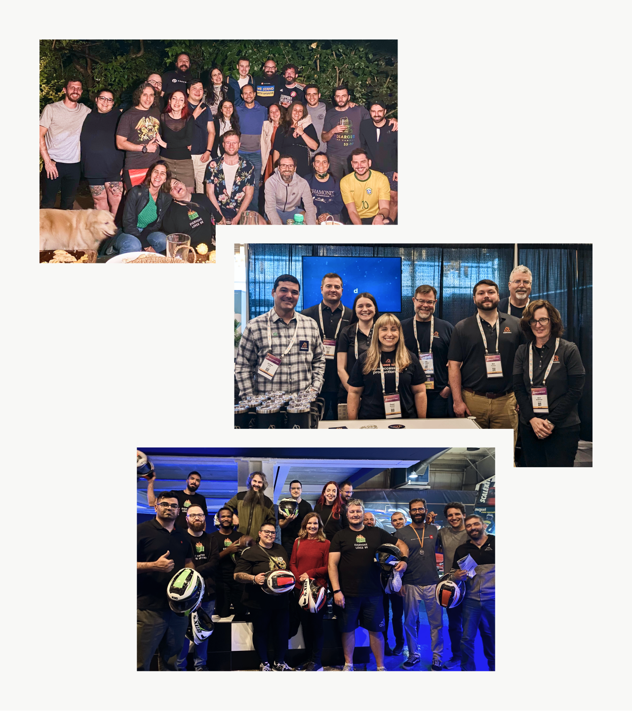

<!--
Where is this happening?

- Born out DB solutions
  - That wouldn't break the bank
  - For small, growing and large companies
  - Later, open-source software
- Freedom to choose
- To support services, namely...
-->

---

## Re-thinking product adoption through documentation design

Why would we?

<!--
_class: sep
-->

<!--
- Why would we want to shape docs?
- Why improve them?
- Why would we care about docs 1st and software growth later?
-->

---

### Motivations

- Databases for everyone
- Promote independence
- More and better contributions
- Optimization of Support
- Don’t break the bank

<!--
Here are some of our motivations:

- Databases for everyone
  - Any technical background
  - Spark creativity
  - Help learn databases
- Promote independence
  - Lower the entry barrier
  - Reduce effort and time
- More and better contributions
  - Increase discussion
  - Multiply solutions
  - For anyone
- Optimization of Support
  - Focus on bigger problem
  - Societal blockers
- Don’t break the bank
  - Anyone can get in
  - Regardless of price
  - Grow at their pace
  - Scale when ready

Documentation can help.
-->

---

### Databases = Hard  Software = Hard  Design = Hard

Technical, complex, costly

Error 404: Design culture not found

Rapid software ≠ Rapid UX

<!--
_class: v-align
-->

<!--
- Technical, complex, costly
  - Intimidating
  - Specific terminology
  - Abstract structures
  - Lack user centricity
  - Increase user base = more research costs
- Error 404, Design culture not found
  - Percona
    - Wasn't born user-centric
    - Focused on technical solutions
    - Working/not working things
- Rapid software ≠ Rapid UX
  - If they're not synchronized
  - Needs deep integration
    - Team
    - Processes
  - More time spent
- Documentation
  - Demystify
  - Reach more people
-->

---

While we create something better in-product, what else could we do [**now**]()?

<!--
class: sep boost
-->

---

Imagine assembling this…

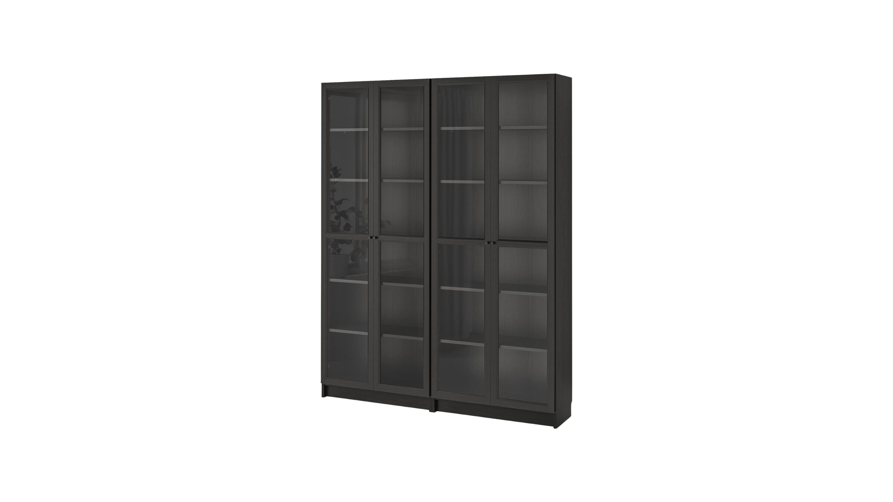

<!--
_class: boost v-align h-align
-->

<!--
Ikea Billy bookshelf with Oxberg doors.

Anyone had a chance of assembling one of these?

I nailed the back, faced the wrong direction. Wood grain, unpainted from the inside. Had to get some more of those micro nails...
-->

---

By only guessing

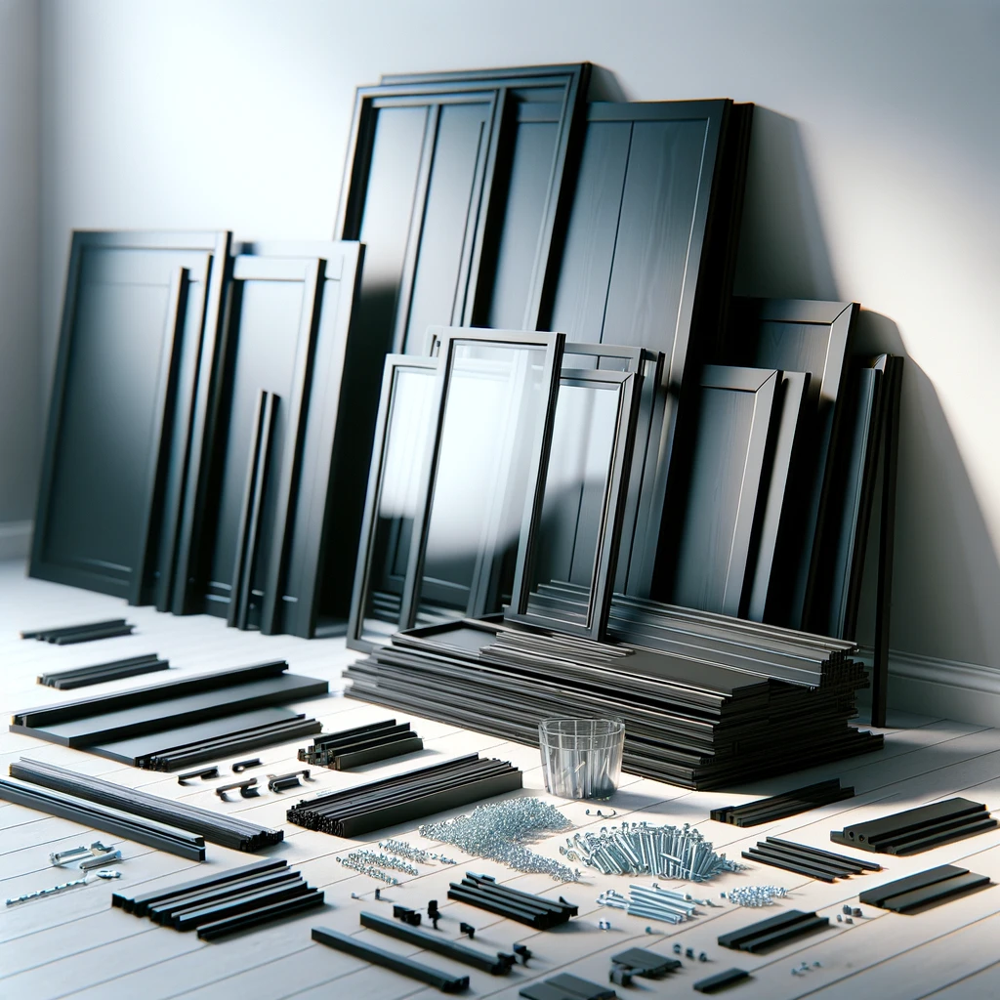

<!--
_class: boost v-align h-align
-->

<!--
...Where each part goes.

- Doors one sided
- All either left or right
- Had to unscrew everything
- Door ugly
  - Chipped inside
-->

---

With documentation, we can promote the adoption and good use of products.

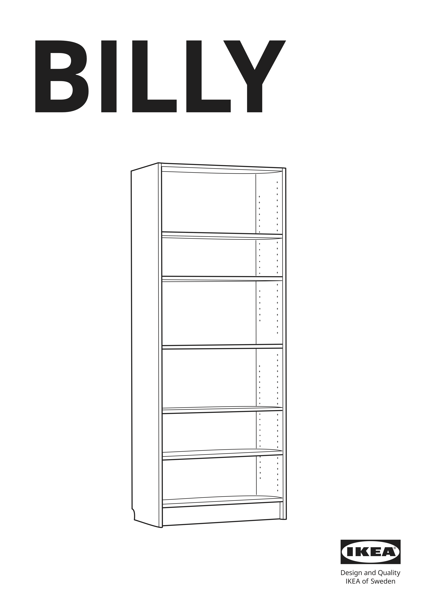

<!--
_class: boost v-align h-align
-->

<!--
- Well designed documentation
- Like IKEA's instructions booklet
- Errors can still happen
- Improves the output
-->

---

With databases, even if you’re an expert,  you must keep the documentation tab open.

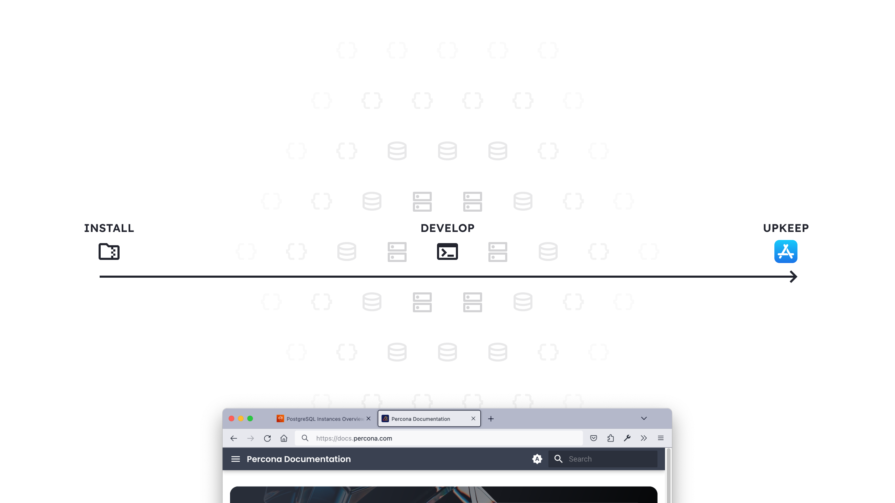

<!--
_class: boost h-align
-->

<!--
Database development -> complexity = high.

1. Installation
2. Development, management and monitoring
   1. An entire world
   2. Connections to make
   3. Components to upgrade
   4. Queries to optimize
   5. Security concerns
   6. Performance concerns
   7. And more
3. Application
   1. Maintain
   2. Optimize
-->

---

## Documentation design rationale

<!--
_class: sep
-->

<!--
- What we did
- What we learned
- What we think
- Open discussion
- Spark ideas
-->

--- 

### Define a strategy

Who’s reading our documentation?
How can it help them and us achieve our goals?
How do we know if it is helping?

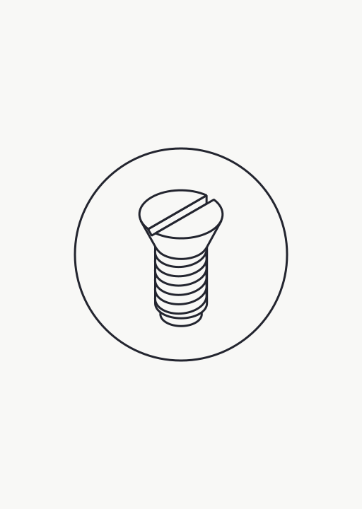

<!--
_class: v-align padding-null-right
-->

<!--
Problem:
- No clear strategy
- Not an instrument to achieve goals.

We wanted to change that and ask...
-->

---

We want documentation to reach out to more [**developers interested in open-source databases**]() for their applications so that adoption increases through [**more installations**](), [**proper retention**](), and [**evident ease of use**]().

<!--
_class: v-align boost h-align
-->

<!--
- Focus on developers
- Not
  - Database administrators
  - Reliability engineer
  - They continue to be our focus
- But
  - Developers need alternatives
  - Independence
  - Often lack diverse teams

Extra:
- Identify people and audit accessibility
- Set objectives
- Define the action scope
- Establish the ownership
- Set standards
- Define tech stack
- Pick health metrics
- Set feedback streams
- Plan maintenance
-->

---

### Establish co-ownership

Who could help?
Where’s the knowledge?
Who could share responsibilities?

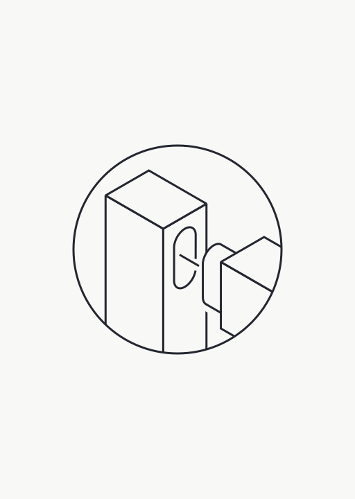

<!--
_class: v-align padding-null-right
-->

<!--
Problem:
- Documentation just existed
- Bare minimum effort
- Had to exist cuz we software house

This is not enough. We asked...
-->

---

#### Kept

- Creation of content
- Management
- Data analysis

#### Added

- Speed
- Visibility
- Openness
- User’s POV
- Horizontal communication
- New methods
- New tools

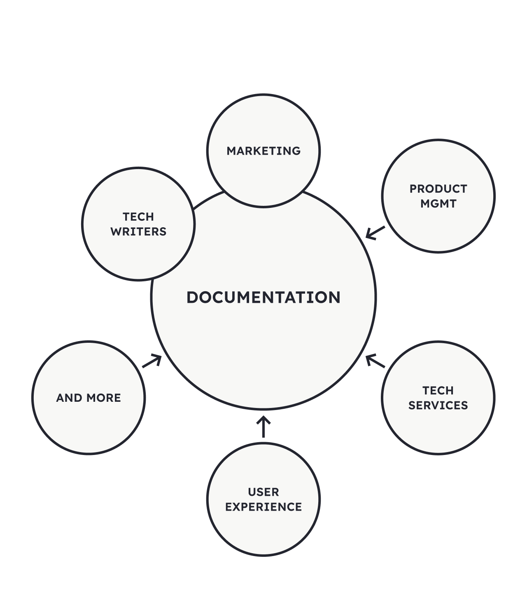

<!--
_class: v-align content-flush-top padding-null-right
-->

<!--
Added:
- Speed + visibility + openness
  - More people seeing
  - Recognizing importance
  - Incite contribution
- We shared all outputs
- Brought user representation
  - Technical Services
  - Account managers
  - Customer success
  - More empirical knowledge
- PMs helped
  - Communicate horizontally
  - Draw attention
  - Move things
  - Garner resources
  - Product POV
- UX team
  - New ways of doing
  - Propose solutions
  - Explored new tools
    - Posthog
-->

---

### Boost clarity

Is the content accessible to people?
Does it provide intuitive access to their needs?
Are there untapped opportunities?

<!--
_class: v-align padding-null-right
-->

<!--
We wanted to ask...

In practice:
- Audited websites
- Analysis from UX POV
- Found mistakes
- Found opportunities
-->

---

<!--
_class: v-align h-align
-->

<!--
- Example of what we had
- We had 17x websites like this
- Built in MkDocs + Material theme
  - Flexible
  - Practical
  - Beautiful theme
  - Open-source
  - A lot of alternatives exist
-->

---

#### Tweaked

- Applied readable fonts
- Added spacing
- Increased chromatic contrast
- Increased reading contrast (headings Vs. running text blocks)
- On-brand re-styling

<!--
_class: content-flush-top
-->

---

#### Added

- Guidelines and resources to place icons, buttons, dividers, and tabs
- Guidelines to flag critical bits of content and decision-making points

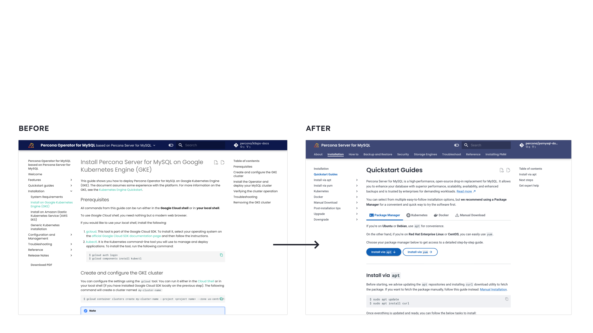

<!--
_class: content-flush-top
-->

<!--
- Not using the full potential
- Maintainers: not versed on visual arrangement
- UX team open to help
-->

---

#### Extended

- New custom components
- Use of more out-of-the-box components

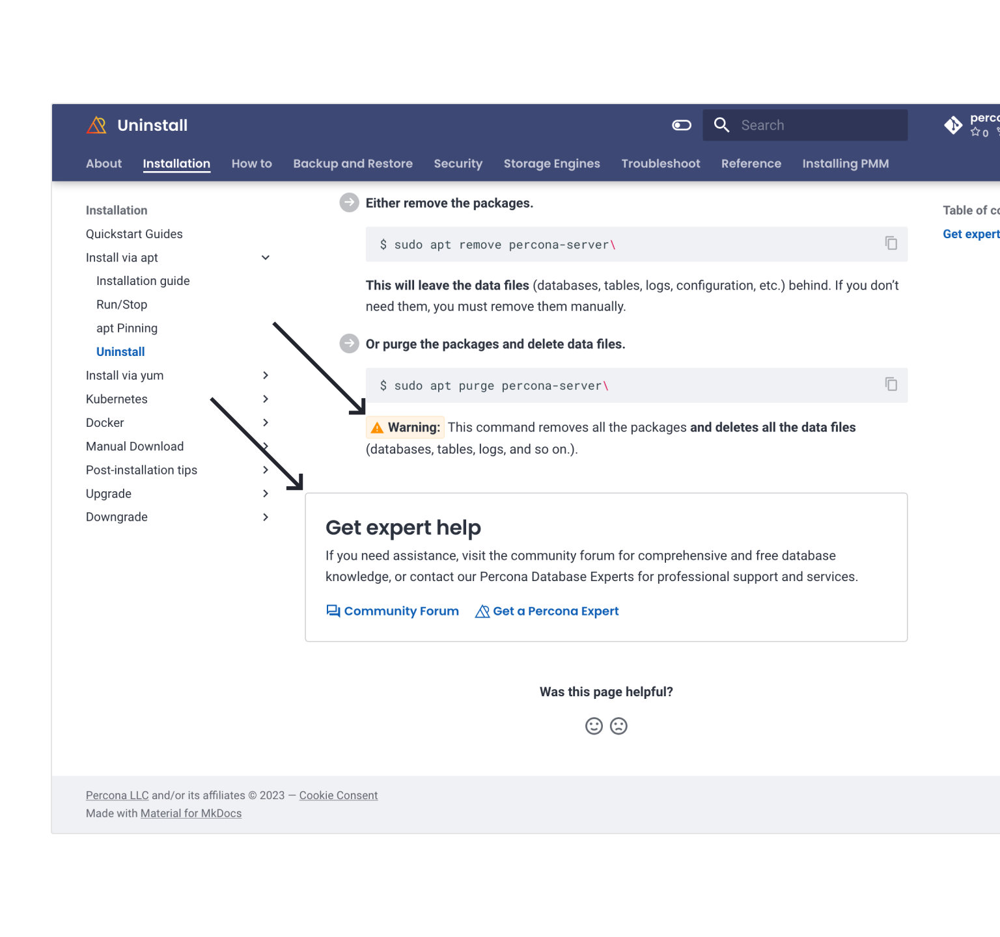

<!--
_class: v-align padding-null-right
-->

<!--
MkDocs — great out of the box, but we wanted more:
- New components
  - Tiny Admonitions
    - When you want more subtle
  - Framed Content
    - When you wish to disrupt
    - Announce
- Use of more
  - Feedback module
-->

---

### Improve the user experience

What can we do for people?
How might we anticipate their needs?
How can we make them succeed?

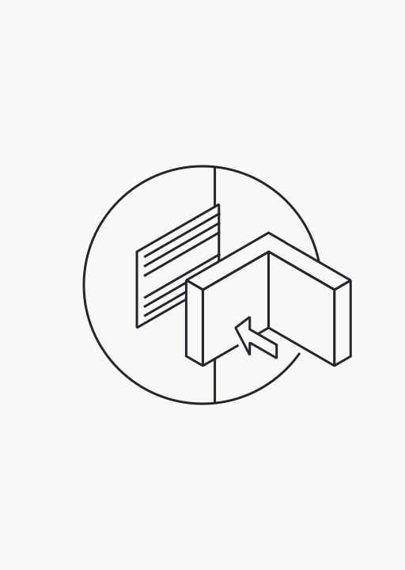

<!--
_class: v-align padding-null-right
-->

---

#### Invested in

- Understanding people’s needs
- Experimenting
- Creating guidelines
- Forming quickstart guides
- Visual prominence for what matters the most

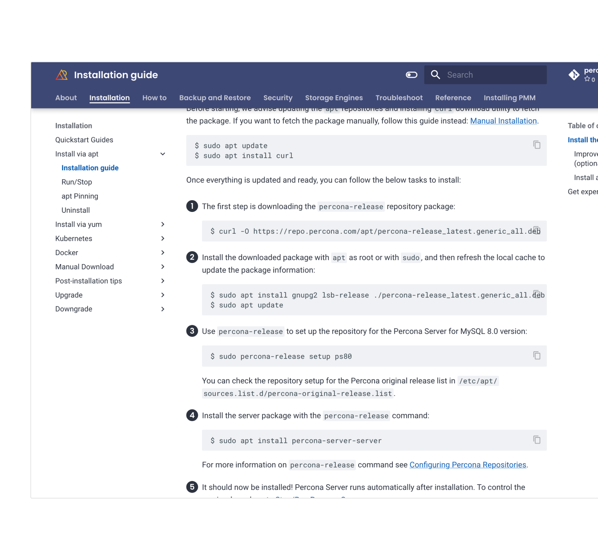

<!--
_class: v-align padding-null-right
-->

<!--
- Research
  - Talked with
  - Talked with experts
  - Garnered the needs
- Experimentation
  - Navigation
  - Top navigation added unnecessary confusion
    - In our case
    - When overlaid with side navigation
    - 2 different patterns don't work
- To improve side navigation
  - Guidelines
  - Make navigation slimmer
  - Streamlined
  - Clear
  - Uncluttered
- Form narratives
  - Guides
  - Quickstart experience
  - Guide to obvious paths
  - Lead to value of product through docs
- To reinforce storytelling
  - Highlighting steps
-->

---

We crafted journeys and [**woven them together**]() so we could guide people into [**discovering the value**]() of our software.

<!--
_class: 
-->

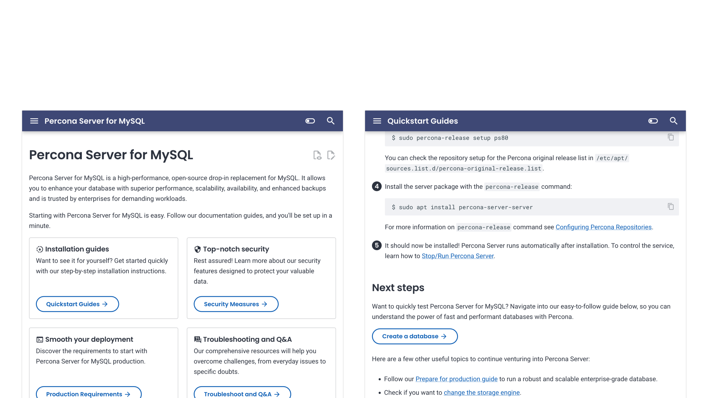

<!--
We used all of these visual cues we have created.

We applied them were it made sense.

The objective was to signpost the most likely journey to the user. While always providing alternative routes.
-->

---

### Unify the experience

Imagine using the documentation.
How does it look? How might we improve it?
Does it feel whole and credible?

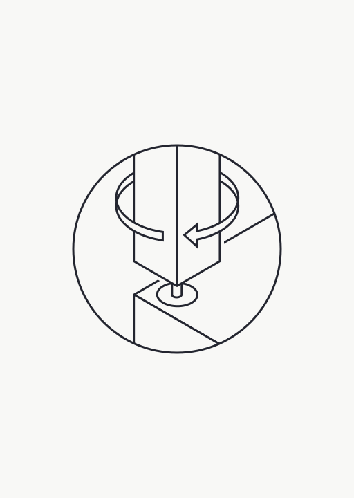

<!--
_class: v-align padding-null-right
-->

---

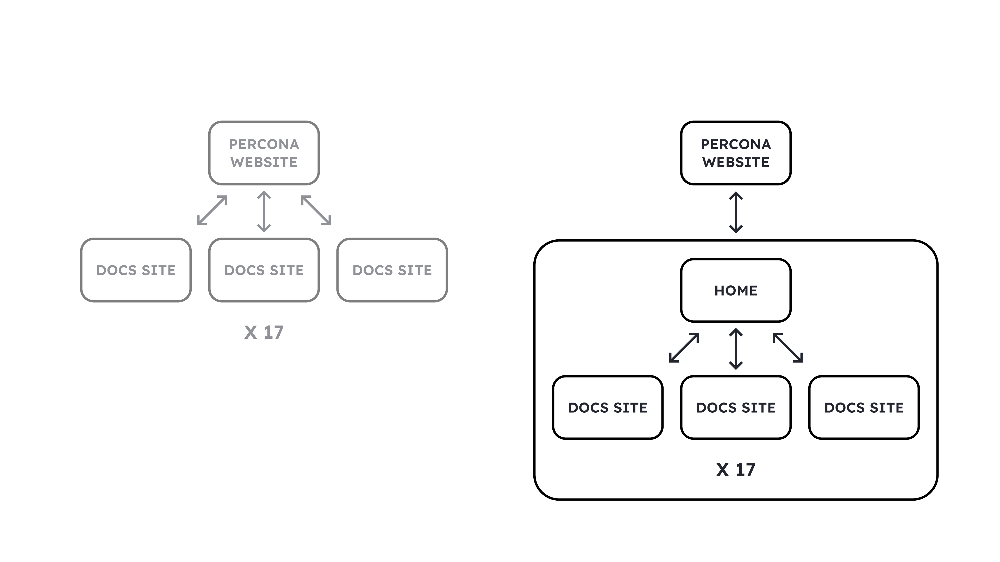

<!--
_class: h-align
-->

<!--
Problems:
- Documentation left by chance
- Disconnected experience
  - Force user to jump
  - Main site
  - To docs
  - Back to main site
- Maintenance problems
  - 2 places
    - Different departments
  - Wordpress
  - MkDocs
- Navigation was unclear
  - No return

Solution:
- Move the home page
- Make it easy to maintain
- Cohesive experience
  - Same navigation
  - Same styling
- Feeling of wholeness
- Boost aesthetic-usability
  - Perceived professionalism
  - Perceived functionalism
  - Things will work
-->

---

<video width="992" height="558">
  <source src="../img/docs_design/final.mp4" type="video/mp4">
</video>

---

### Overview

- Defined a strategy for the documentation
- Established the co-ownership
- Made it clearer and accessible
- Improved the user experience
- Unified documentation websites’ experience

  

### To do

- How users are experiencing changes
- Review outdated content
- Weed out inconsistencies
- Add practical examples/recipes

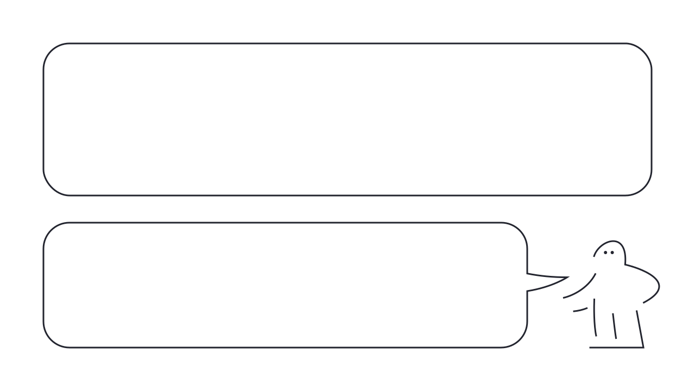

<!--
_class: v-align content-flush-top
-->

<!--
- Defined a strategy for the documentation
  - Generate consensus
  - Understand the usefulness
- Established the co-ownership
  - Share responsibility
  - Garner expertise
- Made it clear and accessible
  - Readable
  - More visible
  - Tweaked where needed to meet needs
- Shaped a better user experience
  - Researched
  - Experimented
  - Created guidelines
  - Made the obvious journeys clearer
- Unified the experience
-->

---

## Thank you!

##### Re-thinking product adoption through documentation design

By Pedro MC Fernandes at

pedro@pmcf.xyz
freenandes@mastodon.social

Rendered with [Marp](https://github.com/marp-team/marpit) and [Lexend](https://github.com/googlefonts/lexend)

<!--
_class: v-align h-align
-->

