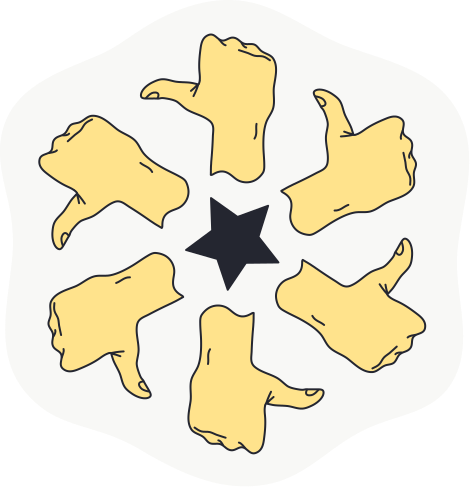
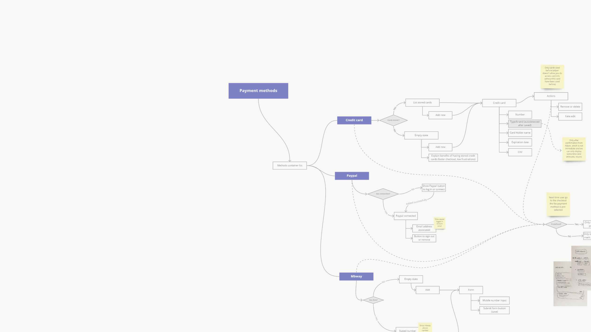

# Pedro M.C. Fernandes

A product designer née  portfolio walkthrough

<!--
_class: sep boost dark contour
_backgroundColor: var(--charcoal)
_color: var(--paper)
-->

---

## Smartidiom’s Internal Apps

<!--
_color: var(--paper)
_class: sep boost
-->

---

### Smartidiom

- Linguistic services
- Core team of about 10 professionals
- Vast network of freelance linguistic professionals
- Customers like Apple, Samsung, Netflix, and more

<!--
_class: v-spaced
-->

---

### Team

- 1 manager
- 2 back-end developers
- 1 designer/front-end developer
- Freedom to create

<!--
_class: v-spaced
-->

---

### Objective

To create an ecosystem of web apps that can reduce time to delivery, but also elevate the quality, of the linguistic services operations

<!--
_class: v-spaced
-->

---

<!-- Scoped style -->

### Problems

- Dense bureaucracy
- Too many emails
- Too many platforms
- Development team of four
- Inexperience
- 2-year deadline
- Tight budget

<!--
_class: content-flush-top
-->

---

### Design Ownership

1. Audit the existing processes
2. Research competitors’ platforms
3. Brainstorm and design a vision
4. Interlink ecosystem and define IA
5. Define usability flows and design key views
6. Testing and validation
7. Develop and upkeep FE components
8. Document and manage styles, components, and patterns

<!--
_class: v-spaced
-->

---

### Front-end Walkthrough

<!--
_class: h-align
-->

---

### Value

- Branding and graphic materials
- Research data and insights
- An open and collaborative design process
- Front-end code contribution
- Slayout design system, a collection of ready-to-use, ready-to-scale UI content and components

<!--
_class: v-spaced dark
_backgroundColor: var(--charcoal)
-->

---

## TUI Lisbon Tech Hub

<!--
_class: sep boost
-->

---

## TUI Group

- Traveling and vacations flights, facilities, amenities, and other services
- Cruise ships, airlines, resorts, hotels, touristic experiences, and more
- About 70k colleagues
- Customers like couples, families with kids, and more

Imagem de __

---

### Team

- 3 managers
- 2 data/SEO pros
- 4 developers
- 2 designers
- Global Distribution Network
- External development partnership companies, ~12 people
- Freedom to innovate
- Large budget
- Entire markets for experimentation

<!--
_class: v-spaced
-->

---

### Objectives

Create modern, clear, out-of-the-box but still effective, shopping and operations web apps for flights, accommodations, and experiences

---

### Problems

- Poor user experience and reputation in the target markets
- Legacy development processes
- Legacy data lakes with huge gaps
- Acute company segregation
- Political disputes and espionage
- COVID-19 affecting travels

<!--
_class: v-spaced
-->

---

### Design Ownership

1. Research with experts and customers
2. Benchmarking, and synthesizing of quantitative and qual. data
3. Brainstorm and design vision(s)
4. Define usability flows and design key views
5. Testing and validation
6. Document and manage styles, components, and patterns
7. Design, set up and code experiments
8. Advocate a new design paradigm within TUI
9. Manage and promote the design system

<!--
_class: v-spaced
-->

---

### Sell the services

Complete e-commerce with self-checkout and account management

<!--
_class: h-align content-flush-top
-->

---

### Guide Travelers

---

### Manage Markets

---

### Distribution

---

### Tagus Design System

---

### Holie

Idea about binding user’s expectations with TUI Group’s services offerings.

Lisbon Tech Hub’s experimentation laboratories

<!--
_class: v-spaced
-->

---

### Value

- Research data and insights
- A fun and playful collaborative design process
- Revamp of 5 declining markets
- 100k web pages for 175 destinations
- ~4x traffic and revenue
- Tagus design system, ready-to-scale interface designs and guidelines 
- Cross-regional sharing of processes, documentation and results
- Mentorship of new designers

<!--
_class: v-spaced dark
_backgroundColor: var(--charcoal)
-->

---

## Percona

- Database-focused services and open-source software
- About 300 colleagues
- Users and customers from hobbyists and non-profit, to education, tech, government, and more

---

### Team

- 5 managers
- 2 designers
- Untapped design opportunities

---

### Objectives

Improve the overall user experience across all open-source software

---

### Problems

- Hazy direction and vision
- Multiple reports of poor user experience
- Profound design debt
- Near-zero product, research, design, and experimentation cultures
- Instability and uncertainty
- Lack of clear intention with design

---

### Process

1. Research with experts and customers
2. Design a vision
3. Create user flows and design key screens
4. Define and document processes
5. Advocate for a culture of problem-solving and innovation
6. Document design, styles, and components
7. Test and set up experiments
8. Own, promote, and upkeep design system

---

### Documentation

---

### PMM