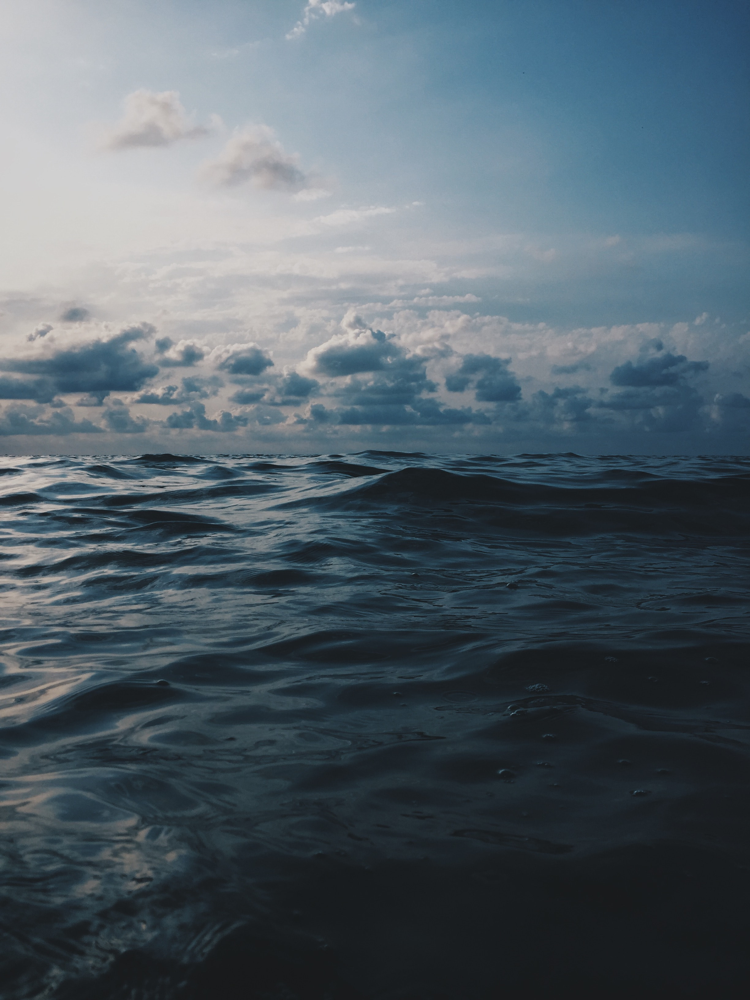
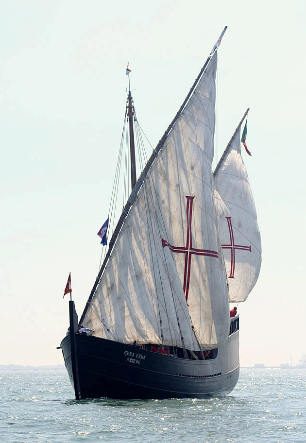
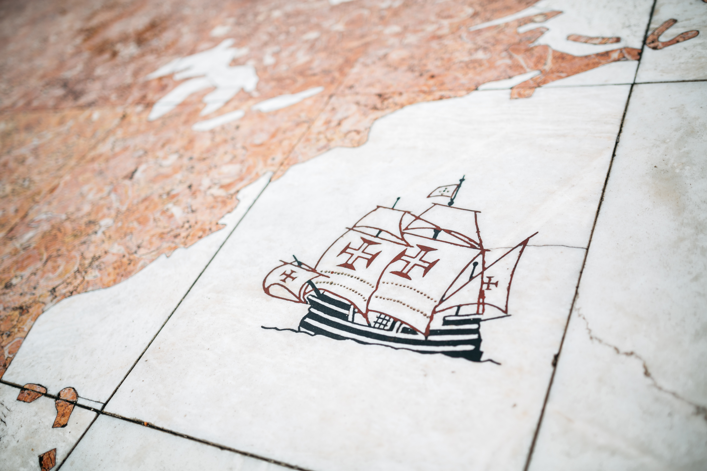

# <!--fit-->Caravela



<!--
_color: var(--paper)
_class: sep
-->

# Caravela


<!--
_color: var(--paper)
_class: sep
-->

## A Caravela

A caravela é um tipo de embarcação inventada pelos portugueses durante a Era dos Descobrimentos, nos séculos XV e XVI.

<!--
header: "A Caravela: Apresentação"
footer: "Sandbox by Pedro MC Fernandes"
paginate: true
_class: boost
-->

## Agostinho da Silva

> Tu podes, com certeza, conviver com os outros, mas nunca seres os outros. Eles podem ser muito bons, mas tu és sempre melhor porque és diferente e o único com as tuas características.

## Forms

This code is using the `<form>` tag to our advantage and then using the `<input type="submit">` at the end.

```html
<form action="/submit.php" method="post">
    <label>Name</label>
    <input type="text" name="name">
    <label>Email</label>
    <input type="text" name="email">
    <label>Message</label>
    <textarea name="message"></textarea>
    <input type="submit" value="Submit">
</form> 
```

### Etimologia

O vocábulo parece ter origem no grego antigo cáravo ou cárabo (κάραβος), designação usada para aludir a um certo tipo de barco ligeiro usado no mediterrâneo, durante a antiguidade clássica. Este vocábulo, por seu turno, terá chegado ao português pelo baixo latim carăbu, que significa «canoa».



### Descrição

A primeira referência documental às caravelas data de 1255, constando do foral de Gaia, no Norte de Portugal, sendo que, então, surgem mormente como embarcações de pesca.



---


# Tipos

<!--
_paginate: false
_class: sep
_footer: ""
-->

### Tipos de Caravela

Há que considerar dois tipos de caravelas.

#### Caravela Latina

A caravela latina é a original, relativamente à qual não há unanimidade na proveniência. É, no entanto, uma evolução do que já existia, provavelmente um navio de pesca do Algarve.

#### Caravela Redonda

A caravela redonda é que se poderá considerar a invenção dos Portugueses já que resultou dos conhecimentos recolhidos e das propostas de Bartolomeu Dias.

### Lista de referências

Em 1531, João III de Portugal encarregou-o da educação dos seus irmãos mais novos, Luís e Henrique. Anos depois, foi também responsável pela educação do neto do rei (e futuro rei), Sebastião.

- Cronologia dos descobrimentos portugueses
- Ciência Náutica Portuguesa
- Navegadores de Portugal

Em 1544 foi-lhe confiada a cátedra de matemática da Universidade de Coimbra, a maior distinção que se podia conferir, no país, à época, a um matemático. 

### Trabalhos originais

Em Agosto de 2009, a Fundação Calouste Gulbenkian e a Academia de Ciências de Lisboa (re)publicaram as obras completas de Pedro Nunes.

1. Tratado em defensão da carta de marear (1539)
2. Tratado sobre certas dúvidas da navegação (1547)
3. De crepusculis (Sobre o Crepúsculo) (1542)

Isto também mostra que Pedro Nunes era um pioneiro na resolução de problemas de máximos e mínimos, que só se popularizaram no século seguinte, com o uso do cálculo diferencial.

### Tomás de Orta

Foi nomeado cosmógrafo-mor em 30 de maio de 1582, em substituição de Pedro Nunes.

No ano seguinte já estaria doente e incapacitado de exercer plenamente as funções e foi reformado em 15 de Junho de 1583 mas mantendo o título até à sua morte em 6 de junho de 1594.

Foi substituído por Luís de Almada (que o apresentou ao cargo), a partir de 4 de abril de 1596 e por João Baptista Lavanha em 13 de fevereiro de 1591.

Sendo que este último foi nomeado definitivamente para o cargo pelo rei Filipe I de Portugal em 10 de Julho de 1596.

### Cortes em Portugal

##### Origem

As Cortes têm origem na antiga Cúria Régia, órgão puramente consultivo que assessorava a Monarquia na resolução de diversas questões, ainda no tempo do Condado Portucalense, sendo que a primeira Cúria documentada para o Reino de Portugal reuniu-se em Coimbra.

###### Composição e funcionamento

As Cortes de Portugal eram compostas pelo clero (prelados diocesanos, representantes dos cabidos e superiores das ordens religiosas), pela nobreza e pelo povo (que era representado pelos procuradores dos concelhos e por algumas pessoas ilustres).

### Heading 3

#### Heading 4

##### Heading 5

###### Heading 6

### Lists

- This is the first level
    - This is the second level
        - This is the third level

1. This is the first level
    1. This is the second level
        1. This is the third level